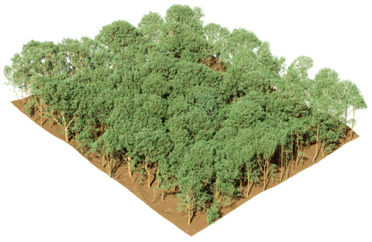

# USD-Scenes

## Required Software

- Any software that can open USD format files

## 2015_Wytham

The study site was a 1-hectare (100 × 100 m) mixed temperate deciduous forest stand with a LAI of 3.8, located within an 18-hectare long-term forest research area managed by the University of Oxford. This forest stand contained six tree species, Sycamore (Acer pseudoplatanus), common ash (Fraxinus excelsior), and common hazel (Corylus avellana) were the dominant species. Three-dimensional structural information of the trees, along with the digital elevation model (DEM), was acquired using a RIEGL VZ-400 terrestrial laser scanner. A FieldSpec (ASD spectrometer) was employed to measure the spectral properties of leaves, bark and understorey vegetation for each tree species. Each tree was individually and explicitly reconstructed. The resulting 3D-explicit model consisted of solid facets whose shapes and sizes closely matched those of the real objects. Stems and branches were initially modeled as cylinders using Quantitative Structural Modeling (QSM) and then converted into hexagonal prisms.

- 2015_Wytham\2015_Wytham.usd:USD file entry.
- 2015_Wytham\Original scene information.xml:\Original scene information.
- 2015_Wytham\original_data\Wytham hyperspectral data.db:Wytham hyperspectral data.
- 2015_Wytham\original_data\IDtoTreeSpecies.txt:The mapping between tree species IDs and tree species types extracted from the XML file.

